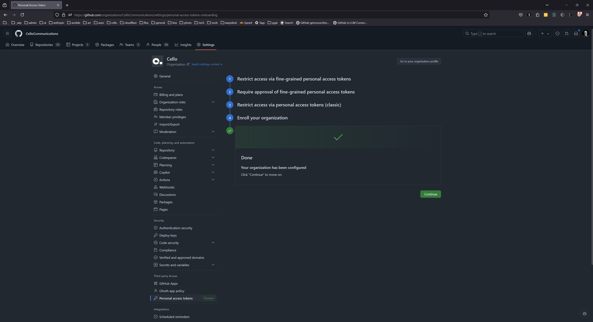

# Notes

[[toc]]

## GitHub Copilot

<https://docs.github.com/en/copilot/customizing-copilot/adding-custom-instructions-for-github-copilot>

## GitHub Repo Sizes

GitHub recommends keeping repositories small, ideally under 1 GB and strongly under 5 GB. Smaller repositories are easier to work with, maintain, and clone.

- [](https://docs.github.com/repositories/working-with-files/managing-large-files/about-large-files-on-github)

  About large files on GitHub

  Repository size limits We recommend repositories remain small, ideally less than 1 GB, and less than 5 GB is strongly recommended.

- **Push size**

  The maximum push size is 2 GB.

  - [](https://docs.github.com/en/get-started/using-git/troubleshooting-the-2-gb-push-limit#:~:text=Troubleshooting%20the%202%20GB%20push%20limit%20%2D%20GitHub%20Docs.)

    Troubleshooting the 2 GB push limit - GitHub Docs

    Troubleshooting the 2 GB push limit - GitHub Docs.

    GitHub Docs

- **Commit listings**

  The compare view and pull requests pages limit the number of commits displayed to 250. The Commits tab limits the number of commits displayed to 10,000.

  - [](https://docs.github.com/en/repositories/creating-and-managing-repositories/repository-limits)

    Repository limits - GitHub Docs

    Commit listings limits The compare view and pull requests pages display a list of commits between the base and head revisions. The...

    GitHub Docs

- **GitHub Pages**

  The recommended limit for source repositories is 1 GB, and the maximum size for published sites is also 1 GB.

  - [link](https://docs.github.com/en/enterprise-server@3.13/pages/getting-started-with-github-pages/about-github-pages#:~:text=GitHub%20Pages%20source%20repositories%20have,no%20larger%20than%201%20GB.)

  - [link](https://docs.github.com/repositories/working-with-files/managing-large-files/about-large-files-on-github)

  About large files on GitHub

  Repository size limits We recommend repositories remain small, ideally less than 1 GB, and less than 5 GB is strongly recommended.

<https://docs.github.com/en/repositories/working-with-files/managing-large-files/about-large-files-on-github>

## MkDocs Material Insiders

<https://squidfunk.github.io/mkdocs-material/insiders/getting-started/>

<https://github.com/sponsors/squidfunk?success=true>

## Confirm Invitation to Insiders Program

<https://github.com/squidfunk/mkdocs-material-insiders/invitations> and accept the invitation.

## Steps to Add GitHub Personal Access Token (PAT)

For a GitHub "organization" we firstly need to enable token access org wide here:

<https://github.com/organizations/CelloCommunications/settings/personal-access-tokens-onboarding>



<https://github.com/settings/tokens/new>

Once thats enabled, we can create a token for the repo here:

<https://github.com/organizations/CelloCommunications/settings/personal-access-tokens/active>

1. **Create Personal Access Token**

   - Go to GitHub Settings → Developer Settings → Personal Access Tokens
   - Click "Generate new token (classic)"
   - Note/Name: `MKDOCS_MATERIAL_INSIDERS`
   - Select scopes:
     - `repo` (full control)
   - Generate token and copy it

2. **Add Secret to Repository**

   - Go to repository Settings <https://github.com/cellocommunications/mkdocs-material-example/settings/secrets/actions>
   - Navigate to Security → Secrets and variables → Actions
   - Click "New repository secret"
   - Name: `GH_TOKEN`
   - Value: _paste your PAT_
   - Click "Add secret"

3. **Verify Workflow Access**

   - The workflow already references the secret correctly:

   ```yaml
   env:
   GH_TOKEN: ${{ secrets.GH_TOKEN }}
   ```

4. **Commit Message for Documentation**

```txt
docs(ci): add instructions for GitHub token setup
```
